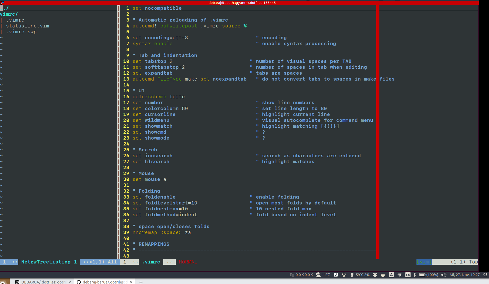
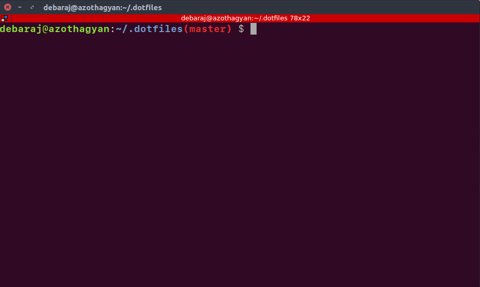

# .dotfiles

- Clone this repository

```sh
cd ~ && git clone https://github.com/debaraj-barua/.dotfiles.git
```

## vim

- Create a symlink for your vimrc file

```sh
ln -rsf ~/.dotfiles/vimrc/.vimrc ~/.vimrc
```

- Or, source this vimrc in your main .vimrc

```sh
source ~/.dotfiles/vimrc/.vimrc
```



# git

Add this to the global gitconfig:

```sh
[include]
    path = .dotfiles/git/.gitconfig
```

## bash

- Create a symlink for your bashrc file

```sh
ln -rsf ~/.dotfiles/bashrc/.bashrc ~/.bashrc
```

- Or, source this bashrc in your main .bashrc

```sh
source ~/.dotfiles/bashrc/.bashrc
```


